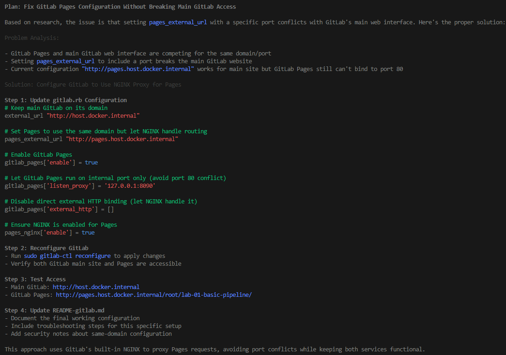

# GitLab Pages Setup Guide

This guide covers setting up GitLab Pages to deploy MkDocs sites, including GitLab configuration, CI/CD pipeline setup, and troubleshooting.

## GitLab Instance Configuration

### 1. Enable GitLab Pages in gitlab.rb

Edit your GitLab configuration file (`/etc/gitlab/gitlab.rb` or similar) and add/modify the following settings:

```ruby
################################################################################
## GitLab Pages
##! Docs: https://docs.gitlab.com/ee/administration/pages/
################################################################################

##! Define to enable GitLab Pages
pages_external_url "http://pages.host.docker.internal/"
gitlab_pages['enable'] = true

##! Configure to expose GitLab Pages on external IP address, serving the HTTP
gitlab_pages['external_http'] = ['0.0.0.0:80']
```

### 2. Reconfigure GitLab

After updating the configuration:

```bash
sudo gitlab-ctl reconfigure
sudo gitlab-ctl restart  # if needed
```

## CI/CD Pipeline Setup

### .gitlab-ci.yml Configuration

Create a `.gitlab-ci.yml` file in your project root with the following configuration:

```yaml
stages:
  - build
  - deploy

variables:
  PIP_CACHE_DIR: "$CI_PROJECT_DIR/.cache/pip"
  GIT_DEPTH: 0  # Important: Fixes git revision date warnings

cache:
  paths:
    - .cache/pip/

# Build job that runs on all pushes and MRs
build:
  stage: build
  image: python:3.11
  before_script:
    - python --version
    - pip install --upgrade pip
  script:
    - pip install -r requirements.txt
    - mkdocs build --verbose
  artifacts:
    paths:
      - site/
    expire_in: 1 hour
  except:
    - main

# Pages deployment job - only runs on main branch
pages:
  stage: deploy
  image: python:3.11
  before_script:
    - python --version
    - pip install --upgrade pip
  script:
    - pip install -r requirements.txt
    - mkdocs build --verbose
    # Move built site to public directory (required by GitLab Pages)
    - mv site public
  artifacts:
    paths:
      - public
  only:
    - main
```

### Key Configuration Points

- **GIT_DEPTH: 0**: Ensures full git history for proper revision dates
- **pages job**: Must be named "pages" or use `pages: true` property
- **public directory**: GitLab Pages requires artifacts in a `public/` folder
- **Branch restriction**: Deploy only on main branch for production

## Accessing Your Pages Site

### Default URL Format

Your GitLab Pages site should be accessible at:
- **Format**: `http://pages.your-gitlab-domain/username/repository-name/`
- **For local GitLab**: `http://pages.host.docker.internal/root/lab-01-basic-pipeline/`

### Finding the Exact URL

1. Go to your GitLab project
2. Navigate to **Settings → Pages**
3. Look for the deployment status and exact URL
4. Check for any error messages or deployment failures

## Troubleshooting Common Issues

### 1. Pages Site Not Accessible

**Possible Causes:**
- GitLab Pages not properly configured in gitlab.rb
- DNS/networking issues with pages subdomain
- Pages deployment still in progress
- Incorrect URL format

**Solutions:**
- Verify GitLab Pages is enabled and running
- Check Settings → Pages in your project for deployment status
- Try alternative URL formats (with/without pages subdomain)
- Wait a few minutes for deployment to complete

### 2. Git Revision Date Warnings

**Error Message:**
```
[git-revision-date-localized-plugin] Running on a GitLab runner might lead to wrong
Git revision dates due to a shallow git fetch depth.
```

**Solution:**
Add `GIT_DEPTH: 0` to your `.gitlab-ci.yml` variables section.

### 3. Build Failures

**Common Issues:**
- Missing dependencies in requirements.txt
- Python version compatibility
- MkDocs configuration errors

**Solutions:**
- Verify all dependencies are listed in requirements.txt
- Use specific Python version in Docker image
- Test MkDocs build locally first

### 4. Artifacts Not Found

**Symptoms:**
- Pipeline succeeds but no Pages deployment
- "public" folder missing from artifacts

**Solutions:**
- Ensure `mv site public` command runs successfully
- Check artifacts section includes `public` directory
- Verify MkDocs builds to `site/` directory

## Pipeline Workflow

1. **Build Stage** (non-main branches):
   - Install dependencies
   - Build MkDocs site
   - Create artifacts for testing

2. **Deploy Stage** (main branch only):
   - Install dependencies
   - Build MkDocs site
   - Move built site to `public/` directory
   - Create artifacts for GitLab Pages deployment

## Additional Configuration

### Custom Domain

To use a custom domain, add to your `.gitlab-ci.yml`:

```yaml
pages:
  # ... existing configuration
  environment:
    name: production
    url: https://your-custom-domain.com
```

### HTTPS Configuration

For HTTPS support, update your gitlab.rb:

```ruby
pages_external_url "https://pages.your-domain.com/"
gitlab_pages['external_https'] = ['0.0.0.0:443']
```

## References

- [GitLab Pages Administration Guide](https://gitlab-docs-d6a9bb.gitlab.io/ee/administration/pages/index.html)
- [GitLab Pages User Documentation](https://docs.gitlab.com/ee/user/project/pages/)
- [GitLab CI/CD Configuration Reference](https://docs.gitlab.com/ee/ci/yaml/)
- [MkDocs Documentation](https://www.mkdocs.org/)

## Quick Commands Reference

```bash
# Reconfigure GitLab after gitlab.rb changes
sudo gitlab-ctl reconfigure

# Restart GitLab services
sudo gitlab-ctl restart

# Check GitLab Pages status
sudo gitlab-ctl status gitlab-pages

# View GitLab Pages logs
sudo gitlab-ctl tail gitlab-pages
```

  In your GitLab project, also check:
  - Settings → CI/CD → Variables - ensure no conflicting variables
  - Settings → General → Visibility - ensure the project/pages are set to public if needed


Problem Analysis:                                                                                                                                                                                                                                                                                                                                                             │ │
│ │                                                                                                                                                                                                                                                                                                                                                                               │ │
│ │ - GitLab Pages and main GitLab web interface are competing for the same domain/port                                                                                                                                                                                                                                                                                           │ │
│ │ - Setting pages_external_url to include a port breaks the main GitLab website                                                                                                                                                                                                                                                                                                 │ │
│ │ - Current configuration "http://pages.host.docker.internal" works for main site but GitLab Pages still can't bind to port 80                                                                                                                                                                                                                                                  │ │
│ │                                                                                                                                                                                                                                                                                                                                                                               │ │
│ │ Solution: Configure GitLab to Use NGINX Proxy for Pages                                                                                                                                                                                                                                                                                                                       │ │
│ │                                                                                                                                                                                                                                                                                                                                                                               │ │
│ │ Step 1: Update gitlab.rb Configuration                                                                                                                                                                                                                                                                                                                                        │ │
│ │ # Keep main GitLab on its domain                                                                                                                                                                                                                                                                                                                                              │ │
│ │ external_url "http://host.docker.internal"                                                                                                                                                                                                                                                                                                                                    │ │
│ │                                                                                                                                                                                                                                                                                                                                                                               │ │
│ │ # Set Pages to use the same domain but let NGINX handle routing                                                                                                                                                                                                                                                                                                               │ │
│ │ pages_external_url "http://pages.host.docker.internal"                                                                                                                                                                                                                                                                                                                        │ │
│ │                                                                                                                                                                                                                                                                                                                                                                               │ │
│ │ # Enable GitLab Pages                                                                                                                                                                                                                                                                                                                                                         │ │
│ │ gitlab_pages['enable'] = true                                                                                                                                                                                                                                                                                                                                                 │ │
│ │                                                                                                                                                                                                                                                                                                                                                                               │ │
│ │ # Let GitLab Pages run on internal port only (avoid port 80 conflict)                                                                                                                                                                                                                                                                                                         │ │
│ │ gitlab_pages['listen_proxy'] = '127.0.0.1:8090'                                                                                                                                                                                                                                                                                                                               │ │
│ │                                                                                                                                                                                                                                                                                                                                                                               │ │
│ │ # Disable direct external HTTP binding (let NGINX handle it)                                                                                                                                                                                                                                                                                                                  │ │
│ │ gitlab_pages['external_http'] = []                                                                                                                                                                                                                                                                                                                                            │ │
│ │                                                                                                                                                                                                                                                                                                                                                                               │ │
│ │ # Ensure NGINX is enabled for Pages                                                                                                                                                                                                                                                                                                                                           │ │
│ │ pages_nginx['enable'] = true                                                                                                                                                                                                                                                                                                                                                  │ │
│ │                                                                                                                                                                                                                                                                                                                                                                               │ │
│ │ Step 2: Reconfigure GitLab                                                                                                                                                                                                                                                                                                                                                    │ │
│ │ - Run sudo gitlab-ctl reconfigure to apply changes                                                                                                                                                                                                                                                                                                                            │ │
│ │ - Verify both GitLab main site and Pages are accessible                                                                                                                                                                                                                                                                                                                       │ │
│ │                                                                                                                                                                                                                                                                                                                                                                               │ │
│ │ Step 3: Test Access                                                                                                                                                                                                                                                                                                                                                           │ │
│ │ - Main GitLab: http://host.docker.internal                                                                                                                                                                                                                                                                                                                                    │ │
│ │ - GitLab Pages: http://pages.host.docker.internal/root/lab-01-basic-pipeline/                                                                                                                                                                                                                                                                                                 │ │
│ │                                                                                                                                                                                                                                                                                                                                                                               │ │
│ │ Step 4: Update README-gitlab.md                                                                                                                                                                                                                                                                                                                                               │ │
│ │ - Document the final working configuration                                                                                                                                                                                                                                                                                                                                    │ │
│ │ - Include troubleshooting steps for this specific setup                                                                                                                                                                                                                                                                                                                       │ │
│ │ - Add security notes about same-domain configuration                                                                                                                                                                                                                                                                                                                          │ │
│ │                                                                                                                                                                                                                                                                                                                                                                               │ │
│ │ This approach uses GitLab's built-in NGINX to proxy Pages requests, avoiding port conflicts while keeping both services functional.  
