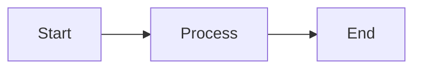

# 🗂️ Project Catalog

[](https://github.com/ly2xxx/catalog/actions/workflows/deploy.yml)
[](https://ly2xxx.github.io/catalog)
[](https://www.mkdocs.org/)

A beautiful, searchable catalog showcasing all my GitHub projects and repositories. Built with MkDocs Material and automatically deployed to GitHub Pages.

## 🌟 Live Site

**Visit the catalog:** [https://ly2xxx.github.io/catalog](https://ly2xxx.github.io/catalog)

## 📋 Table of Contents

- [Features](#-features)
- [Quick Start](#-quick-start)
- [Project Structure](#-project-structure)
- [Adding New Projects](#-adding-new-projects)
- [Customization Guide](#-customization-guide)
- [Content Management](#-content-management)
- [Advanced Features](#-advanced-features)
- [Automation](#-automation)
- [Deployment](#-deployment)
- [Troubleshooting](#-troubleshooting)
- [Contributing](#-contributing)

## ✨ Features

- **🎨 Beautiful Design** - Modern, responsive design using Material Design
- **🔍 Search Functionality** - Full-text search across all projects
- **📱 Mobile Optimized** - Perfect viewing experience on all devices
- **🚀 Fast Loading** - Optimized static site generation
- **📊 Project Categories** - Organized by technology and purpose
- **🔗 Direct GitHub Links** - Easy access to source code and documentation
- **📈 Project Statistics** - Stars, forks, and activity metrics
- **🌙 Dark/Light Mode** - Toggle between themes
- **📖 Rich Documentation** - Comprehensive project descriptions and guides

## 🚀 Quick Start

### Prerequisites

- Python 3.8+
- Git
- GitHub account

### Local Development

1. **Clone the repository**
   ```bash
   git clone https://github.com/ly2xxx/catalog.git
   cd catalog
   ```

2. **Install dependencies**
   ```bash
   pip install mkdocs mkdocs-material mkdocs-git-revision-date-localized-plugin
   ```

3. **Start the development server**
   ```bash
   mkdocs serve
   ```

4. **Open in browser**
   ```
   http://localhost:8000
   ```

### Making Changes

1. **Edit content** in the `docs/` directory
2. **Preview changes** at `http://localhost:8000` (auto-reload enabled)
3. **Commit and push** - GitHub Actions will automatically deploy

## 📁 Project Structure

```
catalog/
├── docs/                          # Documentation source files
│   ├── index.md                   # Homepage content
│   ├── about.md                   # About page
│   ├── contributing.md            # Contributing guidelines
│   └── projects/                  # Project category pages
│       ├── ai-ml.md              # AI & Machine Learning projects
│       ├── dev-tools.md          # Development tools
│       ├── web-apps.md           # Web applications
│       ├── learning.md           # Learning resources
│       └── poc.md                # Proof of concepts
├── mkdocs.yml                     # MkDocs configuration
├── .github/workflows/deploy.yml   # GitHub Actions deployment
└── README.md                      # This file
```

## 📝 Adding New Projects

### 1. Determine Category

Choose the appropriate category for your project:

- **AI & Machine Learning** (`ai-ml.md`) - AI agents, ML models, NLP projects
- **Development Tools** (`dev-tools.md`) - CLI tools, productivity apps, automation
- **Web Applications** (`web-apps.md`) - Frontend/backend applications, APIs
- **Learning & Tutorials** (`learning.md`) - Educational content, tutorials
- **Proof of Concepts** (`poc.md`) - Experimental projects, research

### 2. Add Project Entry

Edit the appropriate category file in `docs/projects/`. Follow this template:

```markdown
### [project-name](https://github.com/ly2xxx/project-name)
**Brief Project Description**

Detailed description of what the project does and its purpose.

- **Tech Stack:** Primary technologies used
- **Features:** Key features and capabilities
- **Status:** Development status (Active, Beta, Prototype, etc.)
- **Stars:** ⭐ X | **Forks:** 🍴 Y (if notable)
- **License:** License type (if applicable)

!!! tip "Key Highlights"
    - Important feature or achievement
    - Notable implementation detail
    - Usage recommendation

---
```

### 3. Update Homepage

If it's a featured project, add it to the homepage (`docs/index.md`):

```markdown
-   **🎯 Project Icon & Title**
    
    ---
    
    Brief description of the project
    
    [:octicons-arrow-right-24: View Project](https://github.com/ly2xxx/project-name)
```

### 4. Update Statistics

Update the project statistics in `docs/index.md`:

```markdown
## 📊 Project Statistics

- **Total Repositories:** XX
- **Primary Languages:** [languages]
- **Focus Areas:** [areas]
- **Active Projects:** XX
- **Stars Received:** XX
```

## 🎨 Customization Guide

### Theme Configuration

Edit `mkdocs.yml` to customize the appearance:

```yaml
theme:
  name: material
  palette:
    # Custom color scheme
    - scheme: default
      primary: indigo        # Change primary color
      accent: teal          # Change accent color
  features:
    - navigation.tabs       # Enable/disable features
    - navigation.sections
    - search.highlight
```

### Navigation Structure

Modify the navigation in `mkdocs.yml`:

```yaml
nav:
  - Home: index.md
  - Projects:
    - Your Category: projects/your-category.md
    - AI & ML: projects/ai-ml.md
  - Custom Page: custom-page.md
```

### Adding Custom CSS

1. Create `docs/stylesheets/extra.css`
2. Add custom styles
3. Reference in `mkdocs.yml`:

```yaml
extra_css:
  - stylesheets/extra.css
```

### Adding Custom JavaScript

1. Create `docs/javascripts/extra.js`
2. Add custom functionality
3. Reference in `mkdocs.yml`:

```yaml
extra_javascript:
  - javascripts/extra.js
```

## 📊 Content Management

### Content Guidelines

#### Project Descriptions
- **Consistent Format** - Use the same structure for all projects
- **Clear Language** - Write for developers of all experience levels
- **Technical Accuracy** - Ensure all technical details are correct
- **Regular Updates** - Keep status and statistics current

#### Images and Media
- **Screenshots** - Include representative screenshots when helpful
- **Diagrams** - Use Mermaid diagrams for architecture explanations
- **Icons** - Use consistent emoji icons for visual hierarchy

#### Links and References
- **GitHub Links** - Always link to the actual repository
- **Live Demos** - Include links to deployed applications
- **Documentation** - Link to additional documentation when available

### Markdown Extensions

The site supports advanced Markdown features:

#### Code Blocks with Syntax Highlighting
```python
def example_function():
    """Example with syntax highlighting"""
    return "Hello, World!"
```

#### Admonitions
```markdown
!!! tip "Pro Tip"
    This is a helpful tip for users.

!!! warning "Important"
    This is something users should be aware of.

!!! info "Additional Information"
    Extra context or details.
```

#### Tabbed Content
```markdown
=== "Python"
    ```python
    print("Hello, World!")
    ```

=== "JavaScript"
    ```javascript
    console.log("Hello, World!");
    ```
```

#### Mermaid Diagrams
```markdown

```

## 🔧 Advanced Features

### GitHub Integration

#### Automatic Repository Data

To automatically fetch repository data, you can create a script:

```python
# scripts/update_repos.py
import requests
import json

def fetch_repo_data(username):
    """Fetch repository data from GitHub API"""
    url = f"https://api.github.com/users/{username}/repos"
    response = requests.get(url)
    return response.json()

def update_project_stats(repos):
    """Update project statistics in documentation"""
    # Implementation to update docs/index.md
    pass

if __name__ == "__main__":
    repos = fetch_repo_data("ly2xxx")
    update_project_stats(repos)
```

#### Repository Badges

Add dynamic badges to show project status:

```markdown
[](https://github.com/ly2xxx/project-name/stargazers)
[](https://github.com/ly2xxx/project-name/network)
[](https://github.com/ly2xxx/project-name/issues)
```

### Search Optimization

#### Search Configuration

Configure search behavior in `mkdocs.yml`:

```yaml
plugins:
  - search:
      lang: en
      separator: '[\s\-\.]+'
      prebuild_index: true
```

#### SEO Optimization

Add meta tags and descriptions:

```yaml
# mkdocs.yml
site_description: "Comprehensive catalog of ly2xxx's GitHub projects and repositories"
site_author: "ly2xxx"

extra:
  social:
    - icon: fontawesome/brands/github
      link: https://github.com/ly2xxx
```

### Analytics Integration

Add Google Analytics or other tracking:

```yaml
# mkdocs.yml
extra:
  analytics:
    provider: google
    property: G-XXXXXXXXXX
```

## 🤖 Automation

### Automated Content Updates

#### GitHub Actions for Content Sync

Create `.github/workflows/update-content.yml`:

```yaml
name: Update Project Content

on:
  schedule:
    - cron: '0 0 * * 0'  # Weekly updates
  workflow_dispatch:

jobs:
  update:
    runs-on: ubuntu-latest
    steps:
    - uses: actions/checkout@v4
    - name: Setup Python
      uses: actions/setup-python@v4
      with:
        python-version: '3.x'
    
    - name: Update repository data
      run: |
        python scripts/update_repos.py
    
    - name: Commit changes
      run: |
        git config --local user.email "action@github.com"
        git config --local user.name "GitHub Action"
        git add docs/
        git diff --staged --quiet || git commit -m "Auto-update project data"
        git push
```

#### Repository Template

Create a template for new projects:

```markdown
<!-- .github/project-template.md -->
### [{{PROJECT_NAME}}]({{REPO_URL}})
**{{BRIEF_DESCRIPTION}}**

{{DETAILED_DESCRIPTION}}

- **Tech Stack:** {{TECH_STACK}}
- **Features:** {{FEATURES}}
- **Status:** {{STATUS}}
- **Stars:** ⭐ {{STARS}} | **Forks:** 🍴 {{FORKS}}

---
```

### Content Validation

#### Pre-commit Hooks

Set up validation for content quality:

```yaml
# .pre-commit-config.yaml
repos:
  - repo: https://github.com/igorshubovych/markdownlint-cli
    rev: v0.37.0
    hooks:
      - id: markdownlint
        args: [--config, .markdownlint.json]
  
  - repo: https://github.com/adrienverge/yamllint
    rev: v1.32.0
    hooks:
      - id: yamllint
```

## 🚀 Deployment

### GitHub Pages (Current Setup)

The site automatically deploys to GitHub Pages via GitHub Actions:

1. **Push changes** to the main branch
2. **GitHub Actions** builds the site
3. **Deployment** happens automatically to `gh-pages` branch
4. **Live site** updates at `https://ly2xxx.github.io/catalog`

### Alternative Deployment Options

#### Netlify
1. Connect your GitHub repository to Netlify
2. Set build command: `mkdocs build`
3. Set publish directory: `site`

#### Vercel
1. Import your GitHub repository to Vercel
2. Framework preset: Other
3. Build command: `pip install mkdocs mkdocs-material && mkdocs build`
4. Output directory: `site`

#### Custom Server
```bash
# Build the site
mkdocs build

# Deploy to your server
rsync -avz site/ user@server:/var/www/catalog/
```

## 🐛 Troubleshooting

### Common Issues

#### Build Failures
```bash
# Check MkDocs configuration
mkdocs serve --verbose

# Validate YAML syntax
python -c "import yaml; yaml.safe_load(open('mkdocs.yml'))"
```

#### Missing Dependencies
```bash
# Install all required dependencies
pip install -r requirements.txt

# If requirements.txt doesn't exist, install manually
pip install mkdocs mkdocs-material mkdocs-git-revision-date-localized-plugin
```

#### GitHub Pages Not Updating
1. Check GitHub Actions workflow status
2. Verify Pages source is set to "GitHub Actions"
3. Check repository permissions

#### Search Not Working
- Ensure search plugin is enabled in `mkdocs.yml`
- Rebuild the site: `mkdocs build --clean`
- Check for JavaScript errors in browser console

### Performance Optimization

#### Large Site Issues
```yaml
# mkdocs.yml - Optimize for large sites
plugins:
  - search:
      prebuild_index: true
  - minify:
      minify_html: true
      minify_css: true
      minify_js: true
```

#### Image Optimization
- Compress images before adding to documentation
- Use appropriate image formats (WebP for modern browsers)
- Consider lazy loading for large image galleries

## 📚 Additional Resources

### MkDocs Documentation
- [MkDocs Official Documentation](https://www.mkdocs.org/)
- [Material for MkDocs](https://squidfunk.github.io/mkdocs-material/)
- [MkDocs Plugins](https://github.com/mkdocs/mkdocs/wiki/MkDocs-Plugins)

### Markdown References
- [Markdown Guide](https://www.markdownguide.org/)
- [GitHub Flavored Markdown](https://github.github.com/gfm/)
- [Material Extensions](https://squidfunk.github.io/mkdocs-material/reference/)

### Design Inspiration
- [Material Design Guidelines](https://material.io/design)
- [GitHub Documentation Examples](https://docs.github.com/)
- [Developer Portfolio Examples](https://github.com/topics/portfolio)

## 🤝 Contributing

Want to improve this catalog or suggest new features? Check out our [Contributing Guidelines](docs/contributing.md)!

### Quick Contribution Steps

1. **Fork** this repository
2. **Create** a feature branch
3. **Make** your changes
4. **Test** locally with `mkdocs serve`
5. **Submit** a pull request

### Types of Contributions

- **Content Updates** - Keep project information current
- **Design Improvements** - Enhance visual design and UX
- **Feature Additions** - New functionality and capabilities
- **Bug Fixes** - Resolve issues and improve reliability
- **Documentation** - Improve guides and instructions

## 📄 License

This project is open source and available under the [MIT License](LICENSE).

## 🙏 Acknowledgments

- [MkDocs](https://www.mkdocs.org/) - Static site generator
- [Material for MkDocs](https://squidfunk.github.io/mkdocs-material/) - Beautiful theme
- [GitHub Pages](https://pages.github.com/) - Free hosting
- [GitHub Actions](https://github.com/features/actions) - Automated deployment

---

**Happy documenting!** 🚀

*For questions or suggestions, please open an issue or start a discussion.*